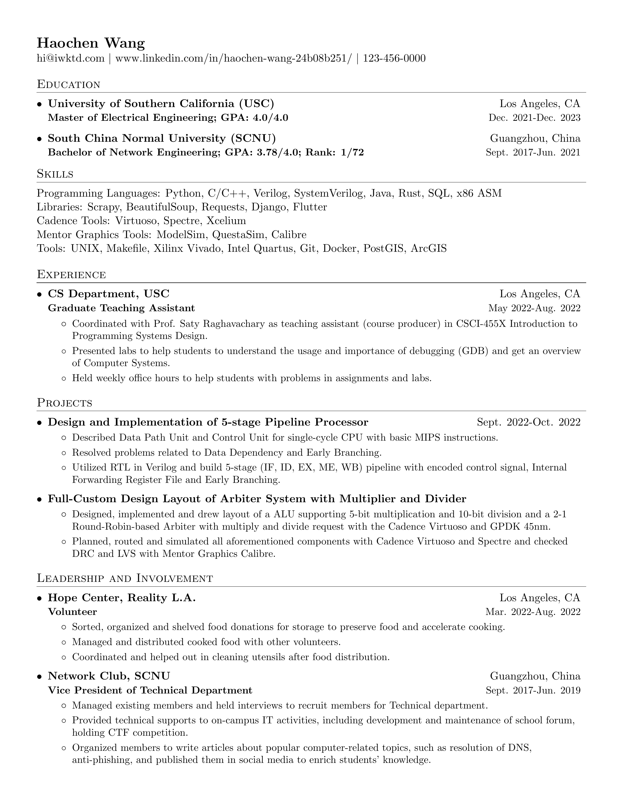

# Resume
> Original Repository: https://github.com/sb2nov/resume
>
> Original Repository Files: `original/`

A single-page, one-column resume for general purpose. It uses the base latex templates and fonts to provide ease of use and installation when trying to update the resume. The different sections are clearly documented and custom commands are used to provide consistent formatting. 

## Preview



## Highlights

Difference comparing with original repository: 
* Use `config.yml` to organize the information to share information across different purpose. 
* Add extra LaTeX commands to suit more applications
* Summarize user-friendly instructions in README
* Comply with rules from USC recommendations in VMock
    * Bold for job title 
    * NO italic for duration

### Extra LaTeX Command

* `\resumeSubheadingNoTitle`: only takes the first line of subheading without job title and duration. 

    

* `\resumeItemOne`: only takes the description instead of skill + description, unlike the original repository. 

### Practical Guide

Refer to [available yaml format](#configyml-format), there are two practical ways to add item/project to a section with `list` as `layout`: 

>   You can DEFINITELY write duration in location's place!

*   Write one with second line by filling all `title`, `location`, `sub_title` and `duration` for that item in the section. 
*   Write one without second line by filling only these two, i.e.,  `title`, `location` for that item in the section. 

## How to Use

There are two ways to generate PDF: 
* Modify Overleaf directly
* Install TeX commandline tool and Use YAML to maintain content
    * In docker (Easiest to Start)
        1. Read General Steps
        2. Refer to [config.yaml format](#configyml-format)
        3. Modify `config.yaml` accordingly
        4. Refer to [Compiler using Docker](#compile-using-docker) and RUN
        5. You get the `template.pdf`
    * Local machine 

### General Steps

1. Refer to [practical guide](#practical-guide) to know the structure and available keys in YAML
2. Modify `config.yml` accordingly with the help of `template.pdf` 
3. Compile and get the `template.pdf` from config.yml

Except `make`, please refer to `Makefile` to know other instructions. 

### Overleaf

This Overleaf template is not yet available. But Sourabh's version is always available. Get started quickly using [Overleaf](https://www.overleaf.com/latex/templates/software-engineer-resume/gqxmqsvsbdjf) template.

### Compile using Docker

> It downloads 2GB data and takes more than 5 minutes. Total size of image is about 4.75GB. 

Execute the followings in the repository directory: 

```sh
docker build -t latex .
docker run --rm -i -v "$PWD":/data latex make
```

Then you will get the `template.pdf`!

### Run Locally

Requirements: TeX commandline tool, Makefile, python3.6+

If you need extra packages, for example in BasicTeX, you have to download the following packages: 
```shell
sudo tlmgr install preprint
sudo tlmgr install titlesec
sudo tlmgr install marvosym
sudo tlmgr install enumitem
```

And then, execute `make`, then you are all set!

## Motivation

I love to use structured format, like Markdown and LaTeX, to present my notes and article. So I choose Sourabh Bajaj's template. And I modified the original template to fit USC's requirements of better resume on VMock. 

Also, I have set up personal resume website: https://www.iwktd.com/ to let others know me comprehensively instead of one-page resume. 

So I have the demand to share the same information across different repository and use YAML as the lanaguage to organize my information. 

## License

Format is MIT but all the data is owned by Kunlin Han

## Acknowledge

This repository is originated from https://github.com/sb2nov/resume . Thank you Sourabh Bajaj for this well organized latex template. For the original files, please refer to `original/` and the original repository. 

## Appendix

### config.yml format
Some of them can be replaced with `""` to set them to blank, but it depends. 

Below is a the full list of content options.
```yml
name: Your name
email: Your email
phone: Your phone
website: Your website or ""

order:
  - Section 1 title
  - Section 2 title
  - Section 3 title
  # You can omit sections to implicitly set section.show = false...
content:
  - title: Section Name
    layout: list # (options: list, text)
    content:
      - show: false # (options: true, false)
        title: Name of item (eg. Company or Project name)
        location: Location of this title
        # These two are optional, but you have to use both or none
        sub_title: Sub title (eg. Qualification or Job title)(optional)
        duration: Duration for the sub-title, e.g., Aug. 2022-Sept. 2023

        # NOT USED. link: Web link (eg. https://sproogen.github.io/modern-resume-theme)(optional)
        description: | # this will include new lines to allow paragraphs
          Main content area for the list item.
  - title: Section Name
    layout: text (options: list, text)
    content: | # this will include new lines to allow paragraphs
      This is where you can write a little more about yourself. You could title this section **Interests** and include some of your other interests.

      Or you could title it **Skills** and write a bit more about things that make you more desirable, like *leadership* or *teamwork*
```